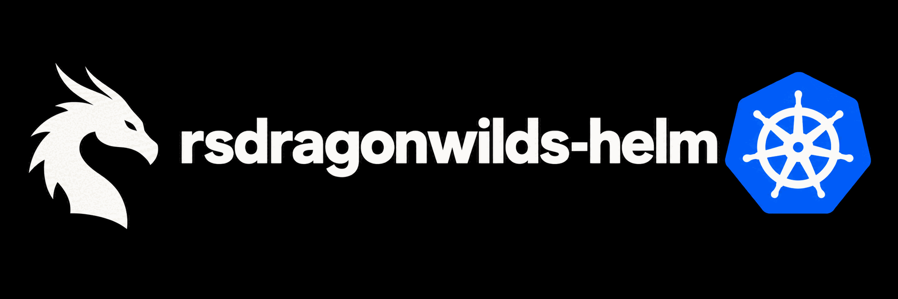

<p align="center">
  
</p>

# RuneScape Dragonwilds Helm chart

[](https://github.com/petzkod5/rsdragonwilds-helm/actions/workflows/ci.yml)
[](https://github.com/petzkod5/rsdragonwilds-helm/releases/latest)
[](LICENSE)
[](https://github.com/petzkod5/rsdragonwilds-helm/pkgs/container/rsdragonwilds-server)

Run one RuneScape Dragonwilds dedicated server per Helm release. The container extends Jagex's official image with [RSDWServerAPI](https://github.com/dkoz/RSDWServerAPI). The chart adds persistent worlds, optional save import, and Prometheus metrics.

This is an unofficial community project. SteamCMD updates the game at startup, independent of the pinned container and mod versions.

## Requirements

- Helm 3 or 4.
- A Kubernetes cluster with an `amd64` worker node.
- A storage class or an existing persistent volume claim.
- A UDP load balancer or another way to expose the game port.
- An EOS player ID from the Dragonwilds game settings.

The default persistent volume claim requests 40 GiB.

## Install a server

Create a namespace and an API token. The chart reads the token from an existing Secret and never generates or replaces it.

```sh
kubectl create namespace dragonwilds
kubectl -n dragonwilds create secret generic rsdw-api \
  --from-literal=token="$(openssl rand -hex 32)"
```

Create `my-values.yaml`.

```yaml
server:
  env:
    RSDW_OWNER_ID: YOUR_EOS_PLAYER_ID
    RSDW_SERVER_NAME: My server
    RSDW_WORLD_NAME: My world
api:
  bearerTokenSecret:
    name: rsdw-api
```

Install the chart.

```sh
helm upgrade --install game oci://ghcr.io/petzkod5/charts/rsdragonwilds \
  --version 0.1.0 \
  --namespace dragonwilds \
  --values my-values.yaml
```

Watch startup and find the server address.

```sh
kubectl -n dragonwilds logs -f deployment/game-rsdragonwilds -c server
kubectl -n dragonwilds get service game-rsdragonwilds
```

SteamCMD downloads the game before startup. The readiness probe waits for the API's `engineReady` flag and does not restart a slow download. Connect with the Service's external numeric IP and UDP port. Public discovery depends on the game and Epic Online Services.

If no save is present, the server creates a world. The persistent volume stores saves at `/home/steam/rsdw-dedicated/RSDragonwilds/Saved/SaveGames`.

To install from a checkout, replace the OCI URL with `./charts/rsdragonwilds` and omit `--version`. Set `image.repository` and `image.tag` to an image that your cluster can pull.

## Configure the chart

[values.yaml](charts/rsdragonwilds/values.yaml) contains every setting and default. [values.schema.json](charts/rsdragonwilds/values.schema.json) rejects unknown chart keys and invalid values. Quote all values in `server.env`.

| Value | Purpose |
| --- | --- |
| `image.repository`, `tag`, `digest`, `pullPolicy` | Select the server image. A digest overrides the tag. An empty tag uses `Chart.appVersion`. |
| `server.port` | Set the game container port and `RSDW_PORT`. |
| `server.env`, `server.extraEnv` | Set upstream variables and Kubernetes `EnvVar` overrides. An override replaces the matching map entry. |
| `config.dedicatedServerIni` | Replace the complete upstream INI template. |
| `persistence.existingClaim`, `size`, `storageClass`, `accessModes`, `retain` | Configure the data volume. `null` uses the cluster's default storage class. `""` requests no storage class. |
| `saveSeed.existingClaim`, `path` | Import one save from a separate read-only persistent volume claim. |
| `api.enabled`, `port`, `bearerTokenSecret.name`, `bearerTokenSecret.key` | Configure the localhost REST API and its existing token Secret. |
| `api.logging.enabled`, `api.logging.verbose` | Set the mod's logging options. |
| `metrics.enabled`, `metrics.image`, `metrics.resources` | Configure the optional metrics exporter. The exporter requires the REST API. |
| `metrics.serviceMonitor.enabled`, `interval`, `labels` | Configure Prometheus Operator discovery. The CustomResourceDefinition must already exist. |
| `metrics.networkPolicy.enabled`, `allowedPeers` | Limit exporter ingress. An empty peer list denies all exporter ingress. Game UDP remains reachable. |
| `service.type`, `port`, `nodePort`, `annotations` | Configure the external game Service. `port` targets `server.port`. |
| `resources`, `nodeSelector`, `tolerations`, `affinity` | Configure resources and Pod placement. The image supports only `amd64`. |
| `imagePullSecrets` | Add registry credentials. Public GHCR packages need none. |
| `podAnnotations`, `podLabels` | Add Pod metadata. Selector labels are reserved. |
| `securityContext`, `containerSecurityContext` | Configure Pod and container security. The default UID, GID, and filesystem group are 1000. |

Each release owns one world and one replica. The Deployment uses `Recreate`. Do not share its persistent volume claim with another running release. Use storage that honors `fsGroup`, or provide a volume writable by UID 1000.

### Server environment variables

| Variable | Default | Purpose |
| --- | --- | --- |
| `RSDW_OWNER_ID` | Required | Set the owner's EOS player ID. |
| `RSDW_PORT` | `7777` | Chart-owned. Set `server.port` instead. |
| `RSDW_SERVER_NAME` | `Dragonwilds` | Set the name shown by the game. |
| `RSDW_WORLD_NAME` | `World` | Set the name for a new world. |
| `RSDW_PASSWORD` | Empty | Set the world password. Empty allows passwordless connections. |
| `RSDW_ADMINS` | Empty | Set a comma-separated list of administrator EOS IDs. |
| `RSDW_ADMIN_PASSWORD` | Empty | Set the server management password. Use a Secret reference. |
| `RSDW_ADDITIONAL_ARGS` | Empty | Pass upstream command-line arguments. Quoted arguments are supported. |
| `RSDW_AUTO_STOP_ON_UPDATE` | `false` | Enable upstream stop-on-update behavior. Read [Known limits](#known-limits) before use. |
| `DEBUG` | `0` | Set `1` for SteamCMD logs, `2` for game logs, or `3` for both. |
| `STEAMAPPVALIDATE` | `0` | Set `1` to validate game files at startup. |

The upstream legacy name `RSDW_ADDITIONAL_ARGUMENTS` remains available through `server.env`. Prefer `RSDW_ADDITIONAL_ARGS`. You can also set `STEAMCMD_SPEW` and `DEVBUILD_PRESIGNED_URL` there.

The chart reserves `GAMELIFT`, `STEAMAPPDIR`, `LD_PRELOAD`, `RSDWAPI_*`, and `RSDW_PORT`. GameLift is outside this chart's deployment model.

Explicit empty strings remain empty. Do not use the upstream `random` password option for persistent servers. The password changes on each restart and appears in logs.

Helm stores values and inline INI text in release metadata and ConfigMaps. Put credentials in Secret references under `server.extraEnv`.

```yaml
server:
  extraEnv:
    - name: RSDW_PASSWORD
      valueFrom:
        secretKeyRef:
          name: game-passwords
          key: world-password
    - name: RSDW_ADMIN_PASSWORD
      valueFrom:
        secretKeyRef:
          name: game-passwords
          key: admin-password
```

Create `game-passwords` in the release namespace with your secret-management tool or `kubectl create secret generic --from-file`. Values used in INI fields must not contain newlines. Restart the Deployment after you change an external Secret.

### Replace the INI template

Jagex runs `envsubst` on the configured template at startup. The chart replaces the full default template. Include every setting that your server needs.

```yaml
config:
  dedicatedServerIni: |
    [SectionsToSave]
    bCanSaveAllSections=true
    [/Script/Dominion.DedicatedServerSettings]
    AdminPassword=${RSDW_ADMIN_PASSWORD}
    WorldPassword=${RSDW_PASSWORD}
    ServerGuid=
    ServerName=${RSDW_SERVER_NAME}
    DefaultWorldName=${RSDW_WORLD_NAME}
    AdministratorList=(${RSDW_ADMINS})
    OwnerId=${RSDW_OWNER_ID}
```

The rendered file lives at `RSDragonwilds/Saved/Config/LinuxServer/DedicatedServer.ini` on the data volume. A template change rolls the Deployment. The substitution does not escape values or validate game-specific keys.

Player count has no official environment variable. Pass an Unreal override through `RSDW_ADDITIONAL_ARGS`.

```yaml
server:
  env:
    RSDW_ADDITIONAL_ARGS: '-ini:Game:[/Script/Engine.GameSession]:MaxPlayers=12'
```

The game build determines whether an Unreal override works.

## Import a world

Put a `.sav` file on a separate persistent volume claim in the same namespace. Configure its relative path.

```yaml
saveSeed:
  existingClaim: imported-world
  path: worlds/my-world.sav
```

The init container mounts the source volume read-only and copies the save into `RSDragonwilds/Saved/SaveGames`. It rejects absolute paths, path traversal, and symlinks that escape the source volume. A temporary file and atomic rename protect interrupted copies.

The import runs only when no save or completed-import marker exists. A missing source file stops startup. The source volume must attach to the selected node and allow reads by UID 1000.

To populate a source volume, mount it at `/seed` in a temporary utility Pod. Copy the save with `kubectl cp`, then remove the utility Pod before the server uses the volume.

```sh
kubectl cp ./my-world.sav dragonwilds/UTILITY_POD:/seed/my-world.sav
```

### Restore an existing world

The initial import does not overwrite a world. To restore a save, first back up the current data.

1. Scale the Deployment to zero.
2. Wait for its Pod to stop.
3. Mount the data volume in a maintenance Pod.
4. Move the existing saves and `.seed-complete` marker to a backup location.
5. Copy the chosen save into `SaveGames`.
6. Remove the maintenance Pod.
7. Scale the Deployment to one.

```sh
kubectl -n dragonwilds scale deployment/game-rsdragonwilds --replicas=0
```

Do not edit a live save. The next Helm upgrade restores the chart's fixed replica count of one.

Chart-created persistent volume claims survive `helm uninstall` by default. Reattach one with `persistence.existingClaim`. If you set `persistence.retain=false`, Helm can delete the claim during uninstall. The storage class reclaim policy then controls the underlying volume.

## Monitor the server

RSDWServerAPI listens on `127.0.0.1` inside the Pod. The chart exposes no REST or RCON Service. The mod stores its settings, bans, and logs under `/home/steam/rsdw-dedicated/rsdwapi`. RCON and Discord integrations remain disabled.

The exporter exposes a ClusterIP Service at `game-rsdragonwilds-metrics:7979`. Enable its NetworkPolicy because the exporter accepts probe targets and holds an API credential. Your cluster network plugin must enforce NetworkPolicy.

```yaml
metrics:
  networkPolicy:
    enabled: true
    allowedPeers:
      - namespaceSelector:
          matchLabels:
            kubernetes.io/metadata.name: monitoring
        podSelector:
          matchLabels:
            app.kubernetes.io/name: prometheus
  serviceMonitor:
    enabled: true
    labels:
      release: prometheus
```

Without Prometheus Operator, configure both probe jobs. The localhost target refers to the exporter's Pod.

```yaml
scrape_configs:
  - job_name: dragonwilds-health
    metrics_path: /probe
    params:
      module: [health]
      target: ['http://127.0.0.1:8080/api/health']
    static_configs:
      - targets: ['game-rsdragonwilds-metrics.dragonwilds.svc:7979']
  - job_name: dragonwilds-players
    metrics_path: /probe
    params:
      module: [players]
      target: ['http://127.0.0.1:8080/api/players']
    static_configs:
      - targets: ['game-rsdragonwilds-metrics.dragonwilds.svc:7979']
```

| Metric | Meaning |
| --- | --- |
| `rsdw_engine_ready` | API engine readiness, either 0 or 1. |
| `rsdw_uptime_seconds` | Mod process uptime in seconds. |
| `rsdw_players` | Player count reported by the REST API. |

Scraping `/metrics` collects only exporter metrics. HTTP failures return a failed probe. JSON extraction errors in exporter `v0.8.0` omit the affected metric but can return HTTP 200. Alert on both `up == 0` and missing series.

```promql
absent_over_time(rsdw_players{job="dragonwilds-players"}[5m])
```

Do not replace a missing player metric with zero. The API can report an empty roster after an internal read failure, and the exporter cannot distinguish that response from zero players. Use Kubernetes infrastructure metrics for CPU, memory, disk, and network data.

## Develop and test

Install the local test dependency, then run the checks.

```sh
python3 -m pip install PyYAML==6.0.3
bash tests/check.sh
docker build -t rsdragonwilds-server:dev .
bash tests/runtime.sh rsdragonwilds-server:dev
python3 tests/metrics.py
```

`tests/check.sh` checks launcher patches, repeated startup preparation, save import, rejected paths, Helm variants, and invalid values. It runs ShellCheck when available. `tests/runtime.sh` checks the final image's libraries, UID, and installed hook. `tests/metrics.py` runs the exporter against authenticated HTTP fixtures on Linux.

The project has also passed a minimal single-node kind test with an 8 MiB memory request. The test covered Deployment availability, persistent writes across a `Recreate` rollout, UID 1000, disabled service-account token mounting, and persistent volume claim retention after uninstall.

Interactive verification still requires a game client. Join the server, confirm player metrics, restart the Pod, and confirm world progress. Repeat the test with an imported save before you depend on restore behavior.

## Publish a release

Set `version` and `appVersion` in [Chart.yaml](charts/rsdragonwilds/Chart.yaml) to the release version. Run the checks, commit the change, and push a matching tag.

```sh
git tag v0.1.0
git push origin v0.1.0
```

GitHub Actions validates the chart, builds the image, checks its dependencies, and publishes both artifacts.

- Container image: `ghcr.io/petzkod5/rsdragonwilds-server:0.1.0`
- Helm chart: `oci://ghcr.io/petzkod5/charts/rsdragonwilds`, version `0.1.0`

Verify anonymous pulls before you announce a release.

```sh
docker pull ghcr.io/petzkod5/rsdragonwilds-server:0.1.0
helm pull oci://ghcr.io/petzkod5/charts/rsdragonwilds --version 0.1.0
```

GHCR hosts the OCI chart. `helm repo add` does not apply. For public discovery, register the chart with [Artifact Hub](https://artifacthub.io/docs/topics/repositories/helm-charts/).

## Known limits

- Steam can update the game independently and break the mod's memory offsets.
- The image build rejects an unexpected upstream entrypoint. Startup rejects an unexpected downloaded launcher.
- Jagex image `1.1.1` has known update-detection and process-monitoring limits. Test `RSDW_AUTO_STOP_ON_UPDATE` and crash recovery against your game build.
- The Pod has no game readiness probe when the API is disabled.
- RSDWServerAPI tag `0.1.3` reports its internal version as `0.1.1`.
- The exporter supplies no verified tick rate or tick latency.

## License

This repository uses the [MIT license](LICENSE). [THIRD_PARTY_NOTICES](THIRD_PARTY_NOTICES) contains the Jagex and RSDWServerAPI notices and links to SteamCMD's separate terms.
